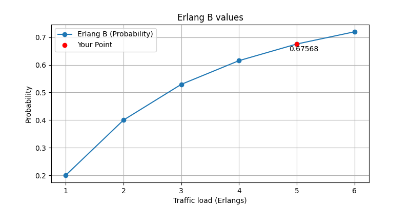
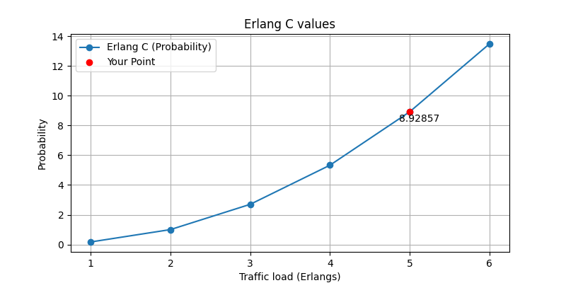

# Erlang Calculator

## Description
This project provides a simple Erlang B and C calculator. It's designed to calculate the blocking and delay probabilities in telecommunications traffic.

## Features
- Calculation of Erlang B (Blocking Probability).
- Calculation of Erlang C (Delay Probability).

## Mathematical Formulas

### Erlang B Formula
Erlang B formula (Blocking Probability, \( B \)):

$$
B = \frac{1}{\sum_{k=0}^{N} \frac{N!}{k!(N-k)!} \left( \frac{A}{N} \right)^k}
$$

Where:
- \( A \) is the offered traffic in Erlangs.
- \( N \) is the number of servers.

#### Result
When the traffic load is 5 Erlangs and there is 2 servers:


### Erlang C Formula
Erlang C formula (Delay Probability, \( C \)):

$$
C = \frac{P \times \frac{A}{N - A + A \times P}}{1 - P \times \left(1 - \frac{A}{N}\right)}
$$

Where:
- \( P \) is the probability of delay (obtained from Erlang B formula).
- \( A \) is the offered traffic in Erlangs.
- \( N \) is the number of servers.

#### Result
When the traffic load is 5 Erlangs and there is 2 servers:


## Installation
Ensure you have Python and Matplotlib installed. Install Matplotlib using pip:

```bash
pip install matplotlib
```